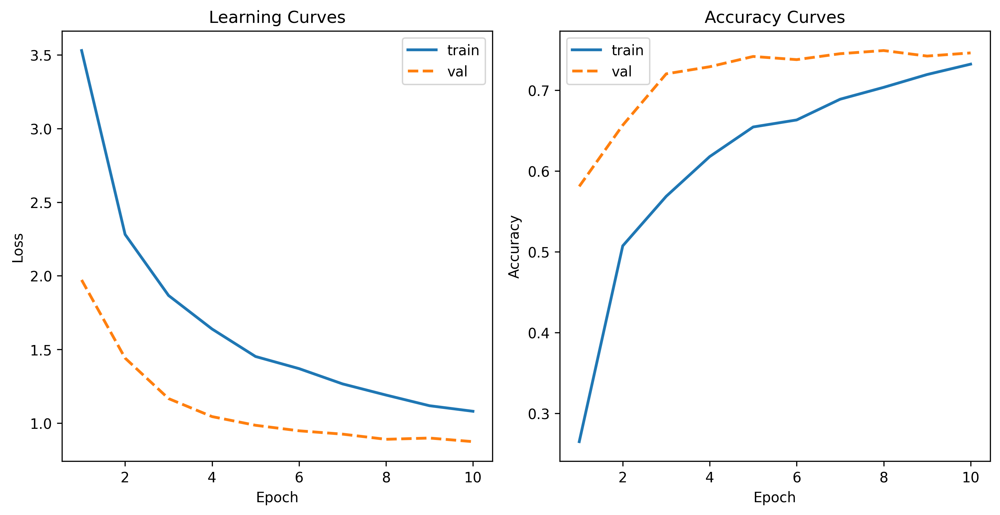
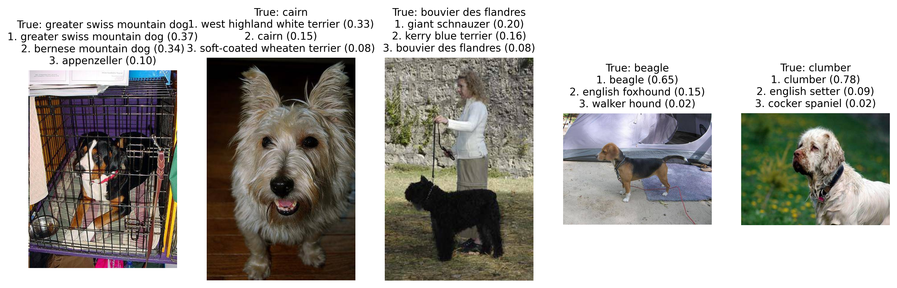

:::writing{variant=“standard” id=“83921”}

# 🐶 Dog Breed Classification with Deep Learning

## Overview

This project builds a dog breed image classifier using deep learning and transfer learning.
The model predicts one of 120 dog breeds from an input image.

The pipeline covers the full ML workflow:
- data loading and preprocessing
- model training and fine-tuning
- evaluation with top-k metrics
- inference and visualization
- error analysis (confusion patterns)

⸻

## Approach

### Model
- Backbone: ResNet18 (pretrained)
- Transfer learning + fine-tuning
- Final fully connected layer adapted to 120 classes

### Training
- Cross-entropy loss
- Adam optimizer
- Learning rate scheduling
- Data augmentation for robustness

### Evaluation
- Train/validation split (stratified)
- Metrics:
    - Top-1 accuracy
    - Top-3 accuracy
    - Top-5 accuracy

Top-k metrics are particularly useful for fine-grained classification:
- Top-1: correct prediction is the highest probability class
- Top-3: correct label appears within the top 3 predictions
- Top-5: correct label appears within the top 5 predictions

This reflects model confidence when multiple classes are visually similar.

⸻

## Results

The model achieves strong performance on this fine-grained classification task,
with high Top-3 and Top-5 accuracy indicating robust feature learning.

| Metric           | Score  |
|------------------|--------|
| Top-1 Accuracy   | 76.3%  |
| Top-3 Accuracy   | 92.5%  |
| Top-5 Accuracy   | 95.8%  |

⸻

## Learning Curves



The model shows steady convergence with no significant overfitting:
- Training and validation loss both decrease smoothly
- Validation accuracy closely tracks training accuracy
- Slightly higher validation accuracy suggests effective regularization and data augmentation

⸻

## Error Analysis

We analyzed the most frequent misclassifications:

Examples:
- Eskimo dog → Siberian husky
- Malamute → Siberian husky
- Standard poodle → Miniature poodle
- Appenzeller → Entlebucher

Most errors occur between visually similar breeds, indicating that:
- the model has learned meaningful visual features
- mistakes are due to fine-grained differences rather than random errors

This highlights the difficulty of fine-grained classification tasks.

⸻

## Inference Examples



The model outputs top-3 predictions with probabilities:

<pre>
```
True: greater swiss mountain dog
1. bernese mountain dog (0.40)
2. greater swiss mountain dog (0.18)
3. entlebucher (0.07)
```
</pre>

## Project Structure

<pre>
```
dog_classifier/
├── data/
├── models/
├── notebooks/
├── src/
│   ├── data.py
│   ├── transforms.py
│   ├── model.py
│   ├── train.py
│   ├── evaluate.py
│   ├── predict.py
│   └── utils.py
├── scripts/
│   ├── train_model.py
│   ├── evaluate_model.py
│   ├── visualize_predictions.py
│   └── confusion_analysis.py
├── api/ (planned)
└── README.md
```
</pre>

## How to Run

### Train model

<pre>
```
python -m scripts.train_model
```
</pre>

### Evaluate model

<pre>
```
python -m scripts.evaluate_model
```
</pre>

### Plot learning curves

```
</pre>
python -m scripts.plot_learning_curves
```
</pre>

### Visualize predictions

<pre>
```
python -m scripts.visualize_predictions
```
</pre>

### Confusion analysis

<pre>
```
python -m scripts.confusion_analysis
```
</pre>

## Future Improvements

- Larger backbone (ResNet50 / EfficientNet)
- Streamlit or FastAPI deployment